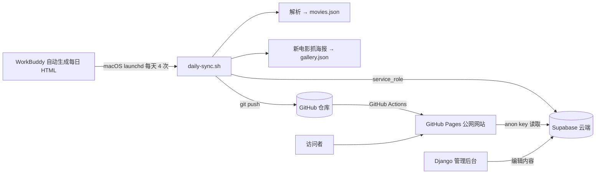

# 每日经典电影推荐网站 · 开发文档

> 版本：v1.0 ｜ 更新日期：2026-08-07
> 技术栈：Vite + React + TypeScript 前端（GitHub Pages）｜ Supabase 云端存储 ｜ Django 内容管理后台 ｜ macOS 定时自动化

---

## 1. 项目概述

一个"每日推荐一部经典电影"的内容网站，包含五大功能标签：每日推荐、电影海报、经典台词、经典解析、联系我们，以及管理员后台。数据每日自动更新，前端托管在 GitHub Pages，内容存储于 Supabase 云端，另配有 Django 后台用于内容管理与权限控制。

**最终上线地址**

- 公网网站：https://messiaguero.github.io/classic-movie-site/
- 源码仓库：https://github.com/MessiAguero/classic-movie-site （公开）
- Supabase 项目：`rltzyqjrmnpdnfnlvtda`（东京区域）
- Django 后台：http://127.0.0.1:8000/admin/（本地）

---

## 2. 总体架构



**关键设计决策**

1. 前端为纯静态 SPA（Vite + React），hash 路由，GitHub Pages 免费托管；
2. 数据默认内嵌本地 `movies.json`，构建时若配置 Supabase 环境变量则改为从云端拉取已发布内容；
3. Supabase 承担数据库、权限（RLS）、对象存储、定时发布（pg_cron）全部后端能力；
4. Django 作为独立内容管理后台（可选后端），内置用户/分组/权限体系；
5. 内容生产链路为"WorkBuddy 生成 HTML → 本机解析同步 → 推送 → 自动部署"。

---

## 3. 目录结构

```text
classic-movie-site/
├─ src/                        # React 前端
│  ├─ components/              # MovieView / Layout / RatingCard / Reveal / AuthModal
│  ├─ pages/                   # Home / Movie / History / Gallery / Poster / Quotes /
│  │                           # Analyses / AnalysisDetail / Contact / Admin
│  ├─ lib/                     # store.ts 数据层 / auth.tsx 认证 / messages.ts 留言 /
│  │                           # cleanQuote.ts 台词清理
│  ├─ data/                    # movies.json（76 部） / gallery.json（76 张海报）
│  └─ styles/theme.css         # B 站风格主题
├─ source-html/                # 76 份原始 HTML（仓库内，供解析器使用）
├─ tools/
│  ├─ parse-html.mjs           # HTML → 结构化 JSON 解析器
│  ├─ fetch-gallery.mjs        # DuckDuckGo 抓取电影海报
│  ├─ refetch-posters.mjs      # 定向重抓海报
│  ├─ daily-sync.sh            # 每日自动同步脚本
│  └─ deploy-github.sh         # 一键 GitHub 发布脚本
├─ supabase/
│  ├─ migrations/              # 0001_init / 0002_auth / 0003_messages
│  ├─ schema-sync.mjs          # movies.json → Supabase
│  ├─ create-admin.mjs         # 创建管理员
│  ├─ setup.sh                 # 一键初始化（psql 建表 + 同步 + 管理员）
│  └─ .env.local               # 本机同步凭据（gitignore，0600）
├─ backend/                    # Django 管理后台
│  ├─ config/                  # settings / urls
│  ├─ movies/                  # models / admin / serializers / views / management
│  └─ requirements.txt
├─ deploy/com.classicmovie.daily-sync.plist   # macOS 定时任务
├─ .github/workflows/deploy.yml               # Pages 自动部署
└─ output/playwright/          # 各阶段验证截图
```

---

## 4. 数据资产与迁移

### 4.1 历史数据

`/Users/admin/WorkBuddy/automation-20260423112820/` 中共有 **76 份**按日期命名的电影推荐 HTML（`movie-recommend-YYYYMMDD.html`，含同日多部 `-2` 变体），跨度 2026-04-27 至 2026-08-06。

### 4.2 三代版式识别

解析前先做了全量结构审计，识别出三代版式（类名体系完全不同）：

| 代际 | 时间 | 特征 |
| --- | --- | --- |
| 早期 | 4–5 月 | `hero-title-cn` / `section-title` 自定义标题 |
| 中期 | 6 月 | `section-title reveal` + 评分卡片/荣誉标签体系 |
| 新版 | 7 月底–8 月 | `sec-head` + 标准标题（口碑评分/剧情/亮点/台词/为什么/荣誉/档案/评语） |

### 4.3 解析器策略

`tools/parse-html.mjs` 采用"**板块标题定位 + 候选类名回退**"的语义化解析：

- 按板块标题正则（`剧情|故事`、`为什么值得|理由`、`荣誉|勋章`、`档案|信息` 等）定位区块；
- 每个字段配置一组按优先级排列的候选选择器，兼容三代 40+ 种 class 命名；
- 标题/年份/海报等设置多种兜底（`<title>` 标签、`data-to` 动画起始值、SVG 尺寸过滤等）；
- 解析后输出字段覆盖率报告，缺失板块自动隐藏不报错。

最终覆盖率（76 份）：片名 100%、评分 99%、剧情 91%、台词 96%、评语 100%、档案 88%、海报 84%。

### 4.4 海报图片

- 维基百科 API 被本机网络屏蔽（403）→ 改用 **DuckDuckGo 图片搜索**；
- TMDB 图源 `original` 尺寸连接失败 → 统一转 `w780` 尺寸（实测可访问）；
- 全量审计 75 张海报，修复 9 张错图（教父/卡萨布兰卡/银翼杀手/末代皇帝/后窗/龙猫/摩登时代/飞屋环游记/情书）；
- 前端图片带 `onError` 回退：真实图 → 手绘 SVG → 占位符。

---

## 5. 前端实现

### 5.1 技术选型

- Vite 8 + React 19 + TypeScript 6
- react-router-dom 7（**HashRouter**，兼容 GitHub Pages 任意子路径）
- @supabase/supabase-js（云端模式才加载，动态 import 拆包）
- 无 UI 框架，手写 B 站风格主题 CSS

### 5.2 路由规划

| 路径 | 页面 |
| --- | --- |
| `#/` | 首页（今日/最近推荐，完整电影页） |
| `#/daily/:id` | 单日电影页（前后日切换） |
| `#/history` | 历史推荐（搜索） |
| `#/gallery` | 电影海报列表 |
| `#/gallery/:id` | 单部电影海报页（海报 + 片名 + 经典语录） |
| `#/quotes` | 经典台词（搜索/随机） |
| `#/analyses`、`#/analyses/:id` | 经典解析列表与详情 |
| `#/contact` | 联系我们（商务合作/联系方式/留言板） |
| `#/admin` | 管理员后台（内容编辑/上下线） |

### 5.3 主题演进

开发过程中经历三次视觉改版：

1. **影院复古暗色**（金棕/衬线，移植原 HTML 设计系统）；
2. **阿根廷队服淡蓝主题**（浅蓝/深蓝/白）；
3. **B 站风格**（最终版）：白底灰面 `#f7f8fa`、粉色主色 `#fb7299`、蓝色点缀 `#00aeec`、苹方/微软雅黑无衬线字体、顶部导航、卡片化布局、标签最终放在右上角一字排开。

### 5.4 核心功能

- **每日推荐页**：Hero 横幅（海报 + 片名/评分/标语）+ 卡片化板块（口碑评分数字滚动动画、剧情、六大亮点、台词、为什么值得一看、荣誉、档案、编辑评语）；
- **台词清理**：`cleanQuote.ts` 去除标签前缀、首尾悬空引号、中文语境多余引号，统一柔和灰色斜体样式；
- **认证**：本地演示模式（localStorage，默认管理员 admin/admin123）+ Supabase 模式（邮箱密码）自动切换；
- **管理员后台**：电影列表搜索、编辑（片名/年份/标语/评语）、上线/下线即时生效；
- **留言板**：本地存储，Supabase 模式同步 `messages` 表（公开提交/审核后公开/管理员全权）。

### 5.5 数据层

`src/lib/store.ts` 为单一数据源：

- 默认从 `movies.json` 初始化（离线可用）；
- 配置 `VITE_SUPABASE_URL` / `VITE_SUPABASE_ANON_KEY` 时，启动后异步拉取 `status=eq.published` 的电影并自动刷新（`useSyncExternalStore` 订阅）；
- 后台编辑写入 localStorage 并同步推送 Supabase（RLS 管理员可写）。

---

## 6. 认证与权限（前端）

双模式架构（`src/lib/auth.tsx`）：

| 模式 | 触发条件 | 存储 | 管理员 |
| --- | --- | --- | --- |
| 本地演示 | 未配置 Supabase | localStorage（SHA-256 加盐） | admin / admin123（自动种子） |
| Supabase | 配置环境变量 | Supabase Auth（邮箱密码） | profiles 表 role=admin |

右上角提供登录/注册，管理员额外显示"后台"入口；普通用户访问 `/admin` 提示无权限。

---

## 7. Django 管理后台

### 7.1 技术栈

Django 4.2.30（兼容 Python 3.9）+ DRF + django-simpleui 2026.1.13（中文现代化主题）。

### 7.2 数据模型

`Movie`（电影推荐，JSON 字段存储评分/剧情/亮点等）、`Quote`（台词）、`GalleryImage`（图片）、`Analysis`（解析）、`SiteConfig`（站点配置）。

### 7.3 权限体系

`python manage.py init_roles --seed` 创建：

| 分组 | 权限 |
| --- | --- |
| 内容编辑 | 查看/新增/编辑/删除，不能发布 |
| 内容审核 | 编辑 + 发布/下线（自定义权限 `can_publish_movie`） |
| 系统管理员 | 全部 |

动作下拉框按权限自动显隐；已实测：编辑角色只有"删除"、审核角色只有"发布/下线"，执行后数据库真实更新。注意 Django 后台要求账号勾选"工作人员状态"（is_staff），`init_roles` 自动处理。

### 7.4 REST API（公开只读）

`/api/movies/`、`/api/quotes/`、`/api/gallery/`、`/api/analyses/`，分页参数 `?page=`；写入统一走后台。

---

## 8. Supabase 云端

### 8.1 迁移文件

- `0001_init.sql`：movies/quotes/gallery_images/analyses/site_config 建表 + RLS + 4 个存储桶 + pg_cron 每日零点发布；
- `0002_auth.sql`：profiles 表 + 注册触发器 + `is_admin()` 函数 + 管理员 RLS；
- `0003_messages.sql`：留言板（公开提交/审核后公开/管理员全权）。

### 8.2 初始化流程

`supabase/setup.sh` 一键完成：psql 执行 3 个迁移 → `schema-sync.mjs` 同步 76 部数据 → `create-admin.mjs` 创建管理员。

> 关键经验：Supabase 直连（`db.<ref>.supabase.co`）要求 IPv6，本机 IPv4 会连接被断；必须走连接池 `aws-0-ap-northeast-1.pooler.supabase.com`（区域前缀需与项目实际区域匹配，通过逐个探测确认该项目在东京）。

### 8.3 数据同步

`schema-sync.mjs` 使用 service_role 批量 upsert 76 部电影及台词；前端读取走 anon key + RLS（仅已发布）。

---

## 9. 部署上线

### 9.1 GitHub Pages

`.github/workflows/deploy.yml`：push 到 main 即 `npm ci && npm run build && upload-pages-artifact && deploy-pages`。

部署命令（一次性）：

```bash
gh auth login
./tools/deploy-github.sh   # 建仓、推送、启用 Pages、轮询输出公网地址
```

### 9.2 构建密钥

仓库 Secrets（Settings → Secrets and variables → Actions）：

- `SUPABASE_URL`
- `SUPABASE_ANON_KEY`

构建时注入为 `VITE_*`，使前端进入云端模式。

---

## 10. 每日自动更新

### 10.1 定时任务

`deploy/com.classicmovie.daily-sync.plist`（launchd，每天 0:10 / 6:00 / 12:00 / 18:00）：

```bash
cp deploy/com.classicmovie.daily-sync.plist ~/Library/LaunchAgents/
launchctl bootstrap gui/$(id -u) ~/Library/LaunchAgents/com.classicmovie.daily-sync.plist
```

### 10.2 同步脚本

`tools/daily-sync.sh`：

1. 从 WorkBuddy 目录复制新增 HTML → `source-html/`；
2. `npm run data:parse` 重新解析；
3. 有新电影时 `npm run data:gallery` 抓海报；
4. 读取 `supabase/.env.local`（service_role）→ `npm run data:sync` 同步云端；
5. git 提交推送 → Actions 自动重新部署。

git 凭据已存入 macOS 钥匙串（`git credential-osxkeychain`）。

---

## 11. 质量保障与验证

- `npm run build`（tsc 严格模式）+ `npm run lint`（oxlint）全程通过；
- `manage.py check` 无问题；
- 浏览器自动化（playwright-cli）实测：全部标签页渲染、评分数字滚动（8.5/9.1/95/100）、搜索/随机、注册登录、管理员权限隔离、留言提交删除、海报加载（75/75）、云端数据请求；
- 各阶段截图存档于 `output/playwright/`；
- 公网部署后验证：页面标题、5 个标签、Supabase REST 请求、最近推荐回退逻辑全部正常。

---

## 12. 开发中遇到的问题与解决（经验记录）

| 问题 | 根因 | 解决 |
| --- | --- | --- |
| 75 份 HTML 三代版式不兼容 | 类名体系完全不同 | 语义化选择器 + 板块标题定位 + 覆盖率报告 |
| 维基百科图片 API 403 | 本机出口 IP 被屏蔽 | 改 DuckDuckGo 图片搜索 + 多级标题匹配 |
| TMDB `original` 图 000 | 该尺寸 CDN 路径被墙 | 统一替换为 `w780` |
| 台词卡片引号与文字重叠 | 装饰引号无左内边距 + 数据混入标签 | 移除装饰引号 + `cleanQuote.ts` 文本清理 |
| 后台/留言删除界面不刷新 | 数组原地修改，`useSyncExternalStore` 认为引用未变 | 变更时返回新数组引用 |
| Django 后台登录失败 | 角色用户缺 `is_staff` | `init_roles` 自动开启 staff |
| `/admin/（账号` 链接 404 | 误粘贴中文到 URL + AdminSite catch-all | 覆写 `catch_all_view` 重定向回后台 |
| launchd plist 加载失败 | 手写 XML 校验不过 | 用 `plutil -convert xml1` 从 JSON 生成 |
| Supabase psql 连接被断 | 直连需 IPv6 | 走东京连接池（`postgres.<ref>` 用户） |
| 数据库密码认证失败 | 中文输入法全/半角字符差异 | 重置为 ASCII 密码 |
| Node fetch 偶发连接错误 | 沙箱网络抖动 | 以 curl 实测为准，前端带 onError 回退 |
| gh 登录缺 `read:org` | 令牌 scope 不足 | git 推送走钥匙串凭据，不依赖 gh 登录 |

---

## 13. 安全说明（重要）

1. **GitHub 令牌**：曾在对话中明文出现，建议立即到 GitHub 设置中撤销并轮换；
2. **service_role key**：仅存于本机 `supabase/.env.local`（0600、gitignore），切勿提交或用于前端；
3. **数据库密码**：初始化后已无脚本依赖，可随时在 Supabase 后台修改；
4. **管理员密码**：网站本地后台默认 admin/admin123、Supabase 管理员 admin123456、Django admin/admin123，上线前务必修改；
5. anon key 为公开信息，配合 RLS 只能读取已发布内容，无法写入。

---

## 14. 本地运行指南

```bash
# 前端
npm install
npm run dev          # http://localhost:5173
npm run build        # 产物 dist/
npm run preview      # 生产预览 http://127.0.0.1:4173

# 数据
npm run data:parse    # HTML → movies.json
npm run data:gallery  # 抓海报
npm run data:sync     # 同步 Supabase（需 .env.local）

# Django 后台
cd backend
python3 -m venv .venv && .venv/bin/pip install -r requirements.txt
.venv/bin/python manage.py migrate
.venv/bin/python manage.py init_roles --seed
.venv/bin/python manage.py runserver   # http://127.0.0.1:8000/admin/

# 每日自动更新
./tools/daily-sync.sh           # 手动同步
DRY_RUN=1 ./tools/daily-sync.sh # 试跑
```

---

## 15. 后续规划

- [ ] 前端登录正式切换到 Supabase Auth（关闭本地演示模式）
- [ ] 留言板展示"已审核"留言（前端读取 approved 状态）
- [ ] Django 后台与前端打通（新增/编辑直接落库）
- [ ] 定制域名 + HTTPS
- [ ] 图库支持剧照分类（stills 桶）
